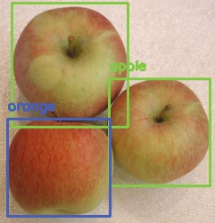

# Deploying Yolov3 model with fastAPI

## Overview
This is a simple process of deploying [Yolov3](https://pjreddie.com/darknet/yolo/), a computer vision model already pre-trained to detect common objects in pictures, on a web server by using [fastAPI](https://fastapi.tiangolo.com/). Then, we will interact with the server via two methods:
- fastAPI's built-in client: `server.ipynb` notebook
- regular code (not some UI): `client.ipynb` notebook
  
 

 ## Run

#### 1. Pulling the necessary image from Docker hub
Docker images can be though as the compilation of all the elements (libraries, files, etc) needed for our software to run. Using the following command will download or pull the image necessary to run this project locally:
```bash
docker pull deeplearningai/mlepc1w1-ugl:jupyternb
```

#### 2. Running a container:

Docker containers are the actual instances of the software running. To run a container, use this command:
```bash
docker run -it --rm -p 8888:8888 -p 8000:8000 --mount type=bind,source="$(pwd)",target=/home/jovyan/work deeplearningai/mlepc1w1-ugl:jupyternb
```
 
Let's break down this command and its flags:
 
- -it: Runs the container in an interactive mode and attaches a pseudo-terminal to it so we can check what is being printed in the standard streams of the container. This is very important since we will have to **copy and paste the access token for Jupyter lab**.

- --rm: Deletes the container after stopping it.
- -p: Allows us to map a port in our computer to a port in the container. In this case, we need a port for the Jupyter server and another for the server we will run within the project.
- --mount: Allows us to mount a directory in the local filesystem within the container. In this case, we are mounting the current directory `Deploy-YOLOV3-Model-with-fastAPI` onto the `/home/jovyan/work` directory inside the container. This is very important because if no mounts are present, changes to files will not persist after the container is deleted. 
  
#### 3. Launching Jupyter Lab 
When the container starts running, the URL of the Jupyter notebook will be printed in the terminal like the image below. 


 
Once we opened that link, click in the `/work` directory and we should see all of the files from the current local directory. Look for the `server.ipynb`  and  `client.ipynb` files and open them to begin.

**Note:** To stop the container once we are done with the project just press `Ctrl + C` twice. This will also delete the container.
 
## Credit
- https://github.com/https-deeplearning-ai/MLEP-public/tree/main/course1/week1-ungraded-lab
   